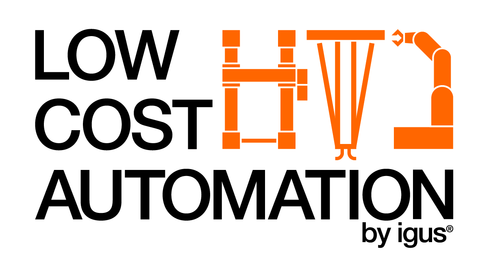

# igus Robot Control with ROS2 Humble

**This is an early beta version. The code WILL change in the near future and is not intended for any serious work right now. If you still use it be cautious when running it on your hardware and know that updating this package may break your running setup!**

**Be very careful when using a Robolink DP 5 or other robots which need to be referenced on startup, as this feature is currently broken for the controllers used in those!**

This repository aims to bring ROS2 support to igus robots. The main focus and is the igus ReBeL in the 6 DOF version, but other devices may also be used, as long as robot controller modules from Commonplace Robotics are used in the kinematics. For a list of currently supported hardware see below.
The hardware communication is available with two different protocols, CRI and CPRCANv2. Links containing more information about these can be found below. The CRI implementation is build upon a ROS Noetic project by [Truphysics](https://www.truphysics.com/), which is linked below as well.

## Overview
The structure of the project tries to follow the general structure of similar ROS2 projects. The following graph tries to provide a general overview of the different packages and how they interact with each other:


For basic robot interaction only irc_ros_hardware, irc_ros_description and irc_ros_bringup are required. The hardware package is used for the communication itself, description contains the robot definitions and bringup the necessary files to start the underlying software.
For robot motion planing moveit is used, the launch file for an igus ReBeL can be found in the irc_ros_moveit_config package. When using a mobile platform Navigation 2 is used, again with the files contained in the irc_ros_navigation package.
The controllers package is used to provide additional module functionality, one of them is providing the data for the dashboard package. For all this the interfacing uses custom messages, which can be found in the respective package.
Last, for some implementation examples please take a look at irc_ros_examples.

## Supported Hardware:
In general all kinematics using CPR modules are usable with this drivers hardware interface. Configuration files are included for the following devices:
 - Robots
   - [igus ReBeL (multiple versions)](https://www.igus.de/product/20962?artNr=REBEL-6DOF-01) 
   - [igus Robolink RL DP 5 ](https://www.igus.de/product/20239?artNr=RL-DP-5) (**See note below**)
 - Platforms
   - [Commonplace Robotics Platform Medium/Butler](https://cpr-robots.com/servicerobotics#mobileplatformmedium)
 - Grippers
   - [Schmalz ECBPMI vacuum gripper](https://www.schmalz.com/en-us/vacuum-technology-for-robotics/vacuum-generators/vacuum-generators-ecbpmi-312576/)
   - Custom CAN controlled gripper ("ext_dio_gripper")

**The main focus is on the igus ReBeL 6DOF robot. All other devices are maintained are only provided as is.**

**Note for Robolink DP 5:** When using the Robolink DP 5 and similar robots you need to reference the axes before being able to use it. This happens automatically on startup in an unsafe manner. If you are an user of this robot please wait for an update for this issue or be very careful during startup.

In case you want to add your own kinematics please take a look at `irc_ros_description/README.md`. If they are a standard device that might be useful for other people please also consider creating a pull request for it :)

## Requirements
This project will only run under linux. One of the main issues is the use of linux sockets for interfacing with the hardware. If an adequate, open source and multi-platform alternative exists, it might be possible for the community to replace the linux-only parts.

**[Note: There appear to be issues using CycloneDDS and the digital IO modules together. If you run into problems please consider using a different implementation](https://github.com/CommonplaceRobotics/iRC_ROS/issues/105)**

General requirements:
 - Ubuntu 22.04 (Recommended)
 - Compiler with C++17 support, e.g. a semi-recent gcc install
 - [ROS2 Humble](https://docs.ros.org/en/humble/Installation/Ubuntu-Install-Debians.html)
   - Might work with ROS2 Iron out of the box as well, but is untested
 - Direct access to the robots CAN bus or an ethernet connection to the `TinyCtrl` host
 - [Navigation2](https://navigation.ros.org/build_instructions/index.html) (Most launch files use Nav2 functions for yaml processing)
 - Optional, only required for parts of the project:
   - [Moveit2 (stable)](https://moveit.ros.org/install-moveit2/binary/)
   - [RQT Robot Steering](https://github.com/cpr-fer/rqt_robot_steering/tree/twiststamped)
   - [Sick S300_2](https://github.com/ajtudela/sicks300_2/tree/humble)
   - [IRA Laser Tools](https://github.com/nakai-omer/ira_laser_tools/tree/humble)
   - [Textual](https://github.com/Textualize/textual)

### Realtime kernel
While ros2_control recommends the use of a real-time kernel we also used a standard Ubuntu 22.04 install without encountering any issues. For installing the RT patch follow [this](https://docs.ros.org/en/humble/Tutorials/Miscellaneous/Building-Realtime-rt_preempt-kernel-for-ROS-2.html) guide.

When compiling the kernel for Ubuntu (22.04) make sure to also install the `dwarves` package before compiling. In the .config file remove the ubuntu certificate names and disable secure boot, else the missing certificates will prevent booting.

## Setup
Install all necessary requirements for the functionality you intend to use and simply clone this in the src/ directory of a ROS2 workspace. You can clone all requires ROS2 packages by running the following command in the workspace folder:

```
vcs import src --input src/iRC_ROS/irc_ros.repos
```

### CRI specific setup
When using CRI make sure the [Embedded Control](https://cpr-robots.com/robot-control#electronics) is reachable under the ip address set in the `irc_ros_description/urdf/*.ros2_control.xacro` configs (default: `192.168.3.11`) You should be able to ping the module in case you are unsure if the ip address is correct

### CAN specific setup
When using CAN set up the interface (default: `can0`, set in the same file as CRI configs) to the right baud rate (500kHz, see the [Protocol User Guide](https://cpr-robots.com/download/CAN/CPR_CAN_Protocol_V2_UserGuide_en.pdf)) and make sure it is up with the command below. This also turns on auto-restarting the interface in case of errors.
Note: This has to be done after each restart, you can also put it in your autostart. This can't be done automatically in the hardware interface as it requires root privileges. 

``` bash
sudo ip link set can0 up type can bitrate 500000 restart-ms 1000
```
Another option when using systemd is to configure it via systemd-networkd. The config is taken from [here](https://www.pengutronix.de/en/blog/2022-02-04-initializing-can-interfaces-with-systemd-networkd.html)

```
# /etc/systemd/network/80-can.network
[Match]
Name=can0

[CAN]
BitRate=500K
RestartSec=1000ms
```

Make sure that systemd-networkd is enabled when you use this approach.
``` bash
sudo systemctl enable systemd-networkd

# To test it without having to restart
sudo systemctl start systemd-networkd
```

## Contributing
CI is done via a Github Action calling a pre-commit file. Please test your pull requests before pushing by running run pre-commit locally.

## Links
#### Other software for igus robots
 - [igus robolink and CPR Mover for ROS1 melodic (using a slightly outdated version of the CAN protocol)](https://github.com/CPR-Robots/cpr_robot)
 - [igus ReBeL for ROS Noetic (using the CRI protocol)](https://bitbucket.org/truphysics/igus_rebel/src/master/)
 - [igus ReBeL javascript-based control](https://github.com/joepuzzo/igus-motor-controller)
 - [igus Robot Control](https://www.igus.de/info/roboter-software)

## Contact and support
If you have any questions regarding the ROS2 package please post an issue on github. For any questions regarding the hardware please contact the Commonplace Robotics support at support@cpr-robots.com.

<p align="center">
  
&nbsp; &nbsp; &nbsp; &nbsp;
  
</p>
