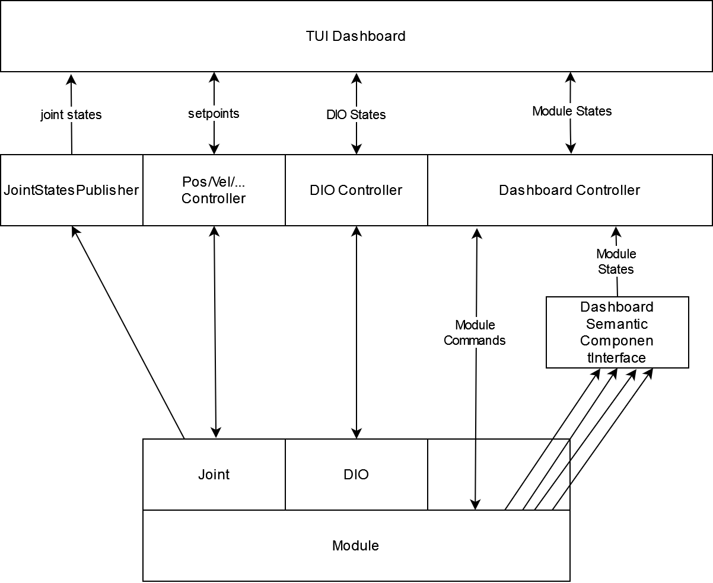

# iRC ROS Dashboard

This project contains a barebone dashboard with a text user interface. It is mostly intended for debugging purposes. Once the interfaces work and all desired functionality is achievable it may be superseded by a nicer RQt/Rviz plugin/Web interface. 

The ROS+TUI idea was inspired by [RTUI](https://github.com/eduidl/rtui).

## Usage
Requires [textual](https://github.com/Textualize/textual).

Define which modules to plot in the controllers .yaml configuration. The dashboard will then connect to the corrosponding controller interfaces and show the data in a table. In the future it will be possible to also send commands from there and showing more in-depth information, this is currently work in progress.

## Structure
Information is provided by DashboardController, DioController, JointStates and standard ros2_control controllers:

## TODO
 - Dont refill the entire table for each update as it loses the focus. (See if solution gets posted e.g. [here](https://github.com/Textualize/textual/discussions/1826))
 - Show more information about the selected interface, e.g. board temperature
 - Dynamically show/hide set_ variables
 - Implement commands such as error resets by clicking on their status cell.
   - For positions/velocities/... a slider in the "more information tab" might be useful (Feature coming to textual [in the future](https://github.com/Textualize/textual/discussions/1878))