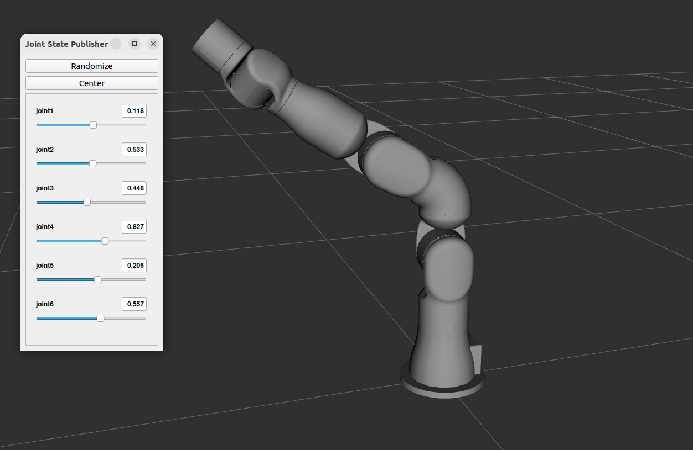

# iRC ROS Description

This folder contains 
launch file for rviz visualisation 
 - `meshes` CAD files for the different robots, see below for possible formats
 - `rviz` config files for rviz
 - `urdf` robot description files
   - `.urdf.xacro` is the top level file to use from `.launch.py` files
   - In the respective subfolders:
     - `.macro.xacro` contains the macro used to generate an instance
     - `.description.xacro` contains the geometric description
     - `.ros2_control.xacro` links to the right `irc_ros_hardware` settings

## Install
If you want to use the visualize launch file to check the correct settings of you axes `joint_state_publisher_gui` is required. Installing it over apt requires adding the right location to the path. Alternatively you can also [add the sources](https://github.com/ros/joint_state_publisher/tree/ros2) to your workspaces `src/` folder and build it with colcon.

## About the urdf/ folder
As explained above instead of a single static urdf file all kinematics use xacro files. Xacro enables preprocessing the documents and combining different files into a single robot description. For cleaner robot descriptions the geometric information and the control parameters are split into two files.

### Kinematic chain
The package aims to be as modular as possible. As such you can combine a mobile platform, robot arm and gripper into a single kinematic. For this start with the highest level kinematic and select the child-kinematics with xacro parameters (via launch parameters). Currently this causes issues with duplicate link names and root links, but this issue should be resolved once this repository is set to public.

#### Xacro arguments
 - `prefix`
 - `gripper`
 - `continuous_last_joint` (only for robots, not platforms)
 - `rebel_version` (igus ReBeL only)

All of these are set via launch arguments from the respective launch files.
Use `ros2 launch irc_ros_[...] [...].launch.py --show-args` for more information about the available arguments for a launch file.

### Hardware protocol/mock hardware selection
This is done over launch arguments, use `ros2 launch irc_ros_[...] [...].launch.py --show-args` for more information. If not hardware protocol is specified cprcanv2 is used by default.

Specific settings are set in the respective ros2_control files:

#### CAN settings
 - `can_socket` can interface (defaults to `can0`)
 - Per axis/module:
   - `can_id` At which can_id the module can be found
   - `gear_scale` Only for motor modules. 
   - `controller_type` Defines if the motor module is a closed-loop or open-loop board
   - `referencing_required` if set to true the joint will be referenced on startup.
   - `referencing_priority` The order in which joints are referenced. Same numbers should be referenced simultaniously. If no number is given, the joint will be referenced last.

#### CRI settings
 - `ip` IP address of the EmbeddedControl/TinyCtrl device (defaults to "192.168.3.11")
 - Per axis/module:
   - `cri_joint_offset` Offset between the joints (CPRCAN) zero position and the zero position in CRI

## How to add new robots/grippers/...
 - Start with a basic urdf file for robot. The joint and link values can be obtained e.g. from Datasheets
 - Split the urdf into the different files described at the top of the readme
 - Add meshes. `.obj` files can be obtained e.g. from the [iRC](https://wiki.cpr-robots.com/index.php/Software_Updates#igus_Robot_Control) or [CPRog](https://wiki.cpr-robots.com/index.php/Software_Updates#Installer_for_Windows) `Data/Robots/` folder and converted to either `.mesh`, `.dae` or `.stl`. The robots in the folder where converted with [ctmconv](https://github.com/Danny02/OpenCTM) which lost the colouring in the process.
 - Test with the `visualize.launch.py` file. If your urdf/xacro file is in the irc_ros_description packages `urdf/` folder you can select it via the robot name, e.g. `ros2 launch irc_ros_description visualize.launch.py robot_name:='igus_rebel_4dof'` or the `xacro_file` parameter. If your file resides somewhere else you can use the `xacro_path` parameter.
 - Add ros2_control configuration files
   - .ros2_control.xacro in the `irc_ros_description/urdf/[type]/` folder and controller in `irc_ros_bringup/config/`
   - Look at iRC robot and project files for the parameters:
     - `gear_scale`, joint limits (both robot config) and referencing order (project config) are self-explaining
     - The can id in the robot config is in decimal, while the `can_id` parameter in the ros2_control config is given as hexadecimal number.
     - The `cri_joint_offset` is calculated by dividing `GearZero` by `GearScale` (both in the robot config)
 - Add/adapt launch file in the bringup folder for the application

### Joint limits
While the position limits are rather self-explanatory, set them so the robot does not crash into itself and avoids unwanted configurations, the velocity and acceleration limits are less straight-forward.
Note that the urdf only offers a velocity limit setting, the moveit package also has settings for joint limits in the aptly named file, where also acceleration limits can be set.

Be sure to check the igus robot control software's configuration files if you are using an existing kinematic and take a look at the limits for a good starting point.
For the rebel this means a velocity limit of 45°/s and an acceleration limit of 300°/s^2. Make sure to convert the degrees to radians when changing the settings.
These settings are tested in the field and should work without issues. In case you are not satisfied with the speed of your hardware you may still increase the limits. For the ReBeL joints the previously tested velocity limit was `2.6` instead of roughly `0.7`. This caused issues for some ReBeLs and as such has been lowered to the new settings. (See [#95](https://github.com/CommonplaceRobotics/iRC_ROS/issues/95))

## Rebel versions
In case you bought an igus ReBeL and are unsure which version you own, here are the main differences:
 - `pre` is the prerelease version. The DIOs in the arm are not available and the robot base looks different.
 - `00` is the first sold version, joints 2 and 3 have an offset of 30° compared to `pre`
   - Different urdf, .ros2_control.xacro contains DIO entries
 - `01` is the upcoming version with different gear ratios
    - Same urdf as 00 but different .ros2_control.xacro values for gear ratios
    - difference is only the gear scale for the bigger motor modules
      - 4DOF: Axis 1-3
      - 6DOF: Axis 1-4
