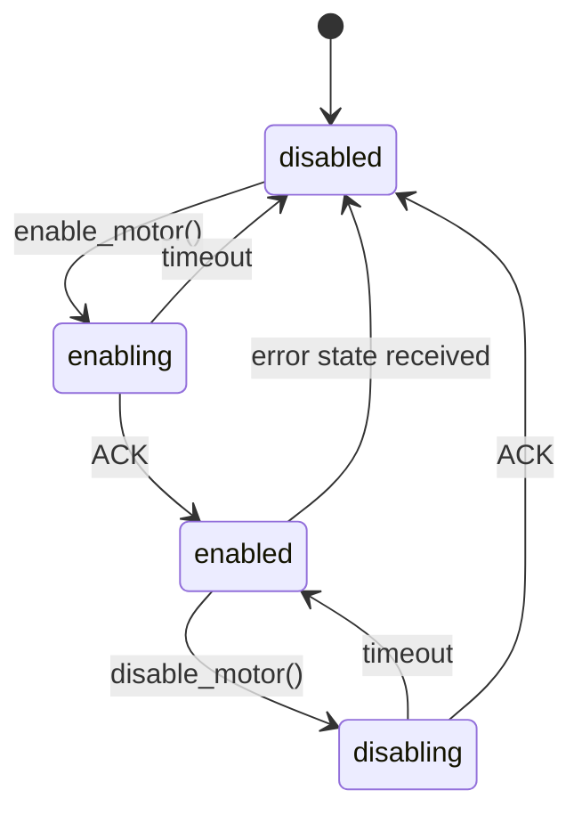
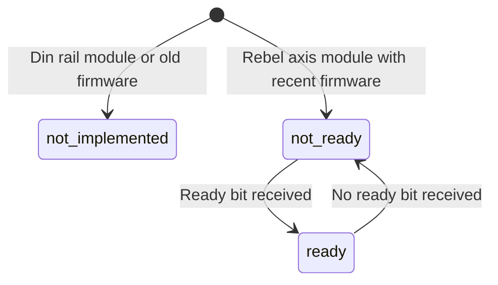
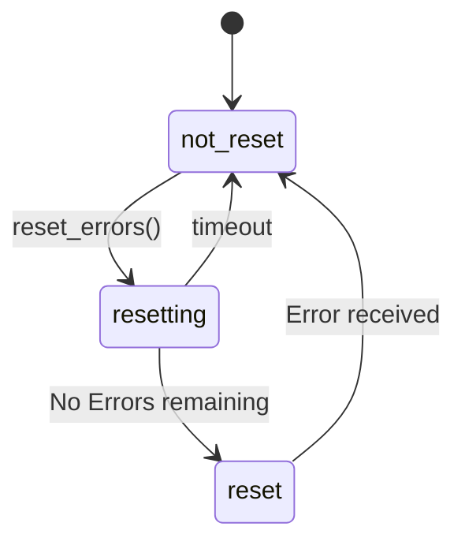
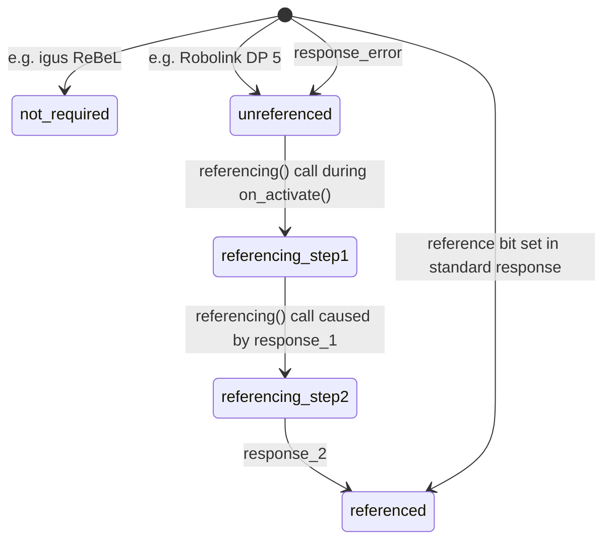
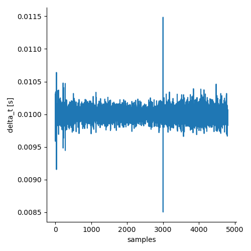

# iRC ROS Hardware interface

**Do not use the CRI interface for any serious work. It is not yet ready for anything besides testing, if even that.**

This package contains the drivers for interfacing with different robots. This can be done both over the CPRCANv2 protocol and the CRI protocol.
The CAN protocol is more perfomant and provides more functionality. The drawback is requiring more direct hardware access. If an EmbeddedControl unit or a igus Rebel with a base is used, the Raspberry Pi inside could be used. This could interfere with TinyCtrl and stop the robot from working with CRI. Furthermore it is untested and the performance might be subpar. Thus it is not advised for general use, instead a dedicated computer with a canbus adapter, e.g. a P-CAN adapter, is recommended.

The CRI interface only works reliable with velocity commands, as TinyCtrl can't handle streaming joint goals. This will either be resolved by a custom ROS2 controller or an update for TinyCtrl. The CRI interface offers the advantage of working directly with existing robots otherwise controlled by iRC/CPRog.

## Usage
The package is intended to be used inside the ROS2_Control ecosystem. The hardware interfaces provide state and command interfaces, which are connected to Controllers. For the movement commands the standard ROS2_Control Controllers are used. For other functionality, DIO and Module states, custom controllers are provided by the `irc_ros_controllers` package.

## CRI
The CRI implementation is based on the [TruPhysics ROS package for the igus ReBel](https://bitbucket.org/truphysics/igus_rebel/src/master/). The protocol version should be V17 2022-08-02, although only a small subset of functions is implemented.

The CRI protocol requires a controller computer running a compatible version of TinyCtrl. It should be reachable under `192.168.3.11`, otherwise the IP needs to configured accordingly.

## CPRCANv2
This aims to implement a subset of the CPRCANv2 protocol. The protocol reference v1.5 released on 2022-07-18 was used, but not all functionality was deemed necessary. The EEPROM commands are not implemented here. Furthermore some undocumented functionality is implemented, notably a movement_ready bit available in more recent rebel axes firmwares.

The can hardware interface works on a per module base. They are collected in the main `irc_ros_can` class for combined hardware interfaces, but otherwise work independatly from each other. Each module is configured via the `.ros2_control.xacro` files with their can_id and module type.
Control works both over position and velocity values, in theory also torque control is available but untested. The proper motion information is received by the position state, the velocity state is a simply, noisy calculation between two position states, only used for mobile platform velocity control.
Module info and control is done via the dashboard found in the `irc_ros_dashboard` package. For debugging the CAN communication `candump`, `cansend` and `ip link show can0` commands provide a good start.

### Hardware Interfaces
#### Joint states
 - hardware_interface::HW_IF_POSITION
 - hardware_interface::HW_IF_VELOCITY (Note: very noisy)
#### DIO states
 - (dio_name)_(number)
#### Module states, found on all devices
 - "can_id"
 - "temperature_board"
 - "temperature_motor"
 - "hardware_ident"
 - "version_major"
 - "version_minor"
 - "error_state"
 - "motor_state"
 - "reset_state"
 - "supply_voltage"

#### Joint commands
 - hardware_interface::HW_IF_POSITION
 - hardware_interface::HW_IF_VELOCITY
 - hardware_interface::HW_IF_EFFORT (Note: untested)
#### DIO commands
 - (dio_name)_(number)
#### Module commands
 - "dashboard_command"
    
### Movement commands
The [CPRCAN V2 startup sequence](https://cpr-robots.com/download/CAN/CPR_CAN_Protocol_V2_UserGuide_en.pdf) combined with the desire to easily switch between position, velocity and torque control is integrated with an internal state that depends on the claimed interfaces. Only one of the interfaces may be used at the same time.

### State machine
These are the current plans and/or statii of the different state machines. Once these are tested with all different hardware combinations these diagrams should be redone in a nicer design.

#### Motor State

The enable_motor() function is called once for a movement startup or via the dashboard interface. Currently disabling is only done manually via the dashboard. It might be an option to disable the motor after a certain delay of no movement commands, if the startup sequence is fast and stable enough.

#### ReadyToMove
Another state that needs to be checked for the readiness to move is the ready to move bit. On rebel axis modules this indicates for position commands if the set_pos variable can be modified from set_pos=current_pos. It is only set shortly after a successful motor enable and is unset once an error/motor disable occurs.

#### ResetState
Used to track the state of error reset commands and error state.

Note that the reset state is reached via a no error-bits set status message, as otherwise an unhandled status message send beforehand may set the state back to not_reset immediately. 

#### SetToZeroState, ReferenceState, RotorAlignmentState
Used to keep track of the state of the corrosponding commands. Only the referenceState should normally change, as the robot should be in the correct alignment state after startup and the position should always be read out/referenced instead of simply setting it to 0.

### Referencing
Older robots without absolute encoders like the Robolink DP 5 need to reference their joint positions on startup. This requires the joints to move to a specific position. This has to be done in a specific order to avoid collisions, which is done during the on_activate method. If the robot was already referenced before this may be read in the standard response.

### Timing
Checking the approximate timing with `candump can0,010:FFF -td` (010 is for the module 0x10, so the first motor module) shows a relatively stable frequency around the set rate of 100Hz. Plotting the data from the highest can id (in the images case 0x40) shows some jitter, if this causes trouble switching to a real time kernel might help. The example can dump and plotting script can be found in `doc/`. For further debugging comparing the jitter peaks with the sending of position messages might be of interest, for which the data is already available in the python plot script.

## TODO
  - CRI and CAN: Make grippers controllable via MoveIt Gripper Action?
  - CAN: Update state machine transitions being all over the place
  - CAN: Remove double copies of status variables once ros2_control supports bool or int variables for interfaces (currently only double is supported)
    - https://github.com/ros-controls/ros2_control/pull/490
    - https://github.com/ros-controls/ros2_control/pull/714
    - ...
  - CAN: Module discovery over status infos?
    - It is not possible to detect all necessary information for setting up axes that way, but a notification that other devices which are not inside of the configuration are sending messages might be useful for debugging purposes.
  - CRI Protocol
    - Big cleanup
    - Add DIO commands
    - Make sure protocol is up to date
    - Compare urdf with prj/robot file set in TinyCtrl?
    - Test if the whole functionality of the project works with it or if some parts are currently CAN only
    - Add dashboard support?
  - CRI and CAN
    - Clean up logging, use advanced logging macros, e.g. throttled
    - Threads -> ROS executor?
      - Is there an advantage for functions that are not interfacing directly with ROS?
    - Use consistent naming scheme for variables and functions.
  - Add launch arguments for IP/Canports/... to overwrite global defaults/robot model `.ros2_control.xacro` file
    - Will make it more complicated to find out which file sets the actual value with .ros2_control.xacro, .hpp defaults, urdf parsing defaults, launch parameters, ...

## Links
### Hardware communication
 - [CAN (including reference and C# demo client)](https://wiki.cpr-robots.com/index.php/CAN_Protocol)
 - [CRI](https://wiki.cpr-robots.com/index.php/CRI_Ethernet_Interface)

### ROS2_Control Hardware Interface info:
 - https://control.ros.org/galactic/doc/getting_started/getting_started.html#hardware-components
 - https://control.ros.org/galactic/doc/ros2_control/hardware_interface/doc/hardware_components_userdoc.html
 - https://control.ros.org/master/doc/ros2_control/hardware_interface/doc/writing_new_hardware_interface.html
 - [Proposal for a modular ros-control architecture](https://github.com/ros-controls/roadmap/blob/master/design_drafts/components_architecture_and_urdf_examples.md#5-modular-robots-with-separate-communication-to-each-actuator)

### Similar ROS2 robot implementations and demos using ros2_control:
 - https://github.com/ros-controls/ros2_control_demos
 - https://github.com/frankaemika/franka_ros2/tree/develop/franka_hardware
 - https://github.com/UniversalRobots/Universal_Robots_ROS2_Driver
 - [Complete list](https://control.ros.org/master/doc/supported_robots/supported_robots.html)

