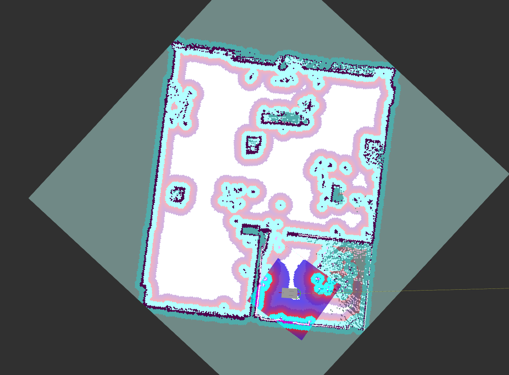

# iRC ROS Navigation2 
This package aims to provide all necessary features for using the mobile platforms based on CPR modules with ROS2. The model used here is a CPR Platform of medium size, more information about it can be found [here](https://cpr-robots.com/servicerobotics#mobileplatformmedium). Currently basic movement commands and SLAM with the SICK laser scanners work.

## Install
Navigation2 and Navigation2-bringup packages need to be installed. The instructions can be found [here](https://navigation.ros.org/build_instructions/index.html). Additionally the `irc_ros_bringup` package and all its requirements are necesssary to use the platform.

## Usage
It is possible to manually send position goals via RVIZ. Another option with the Nav2 simple commander API can be found in the `irc_ros_examples` package.

